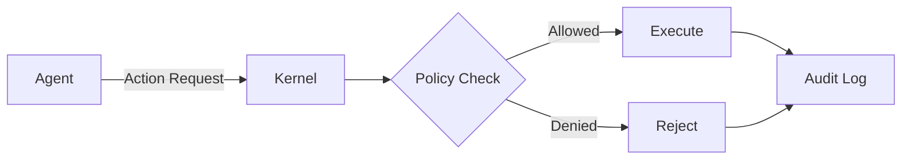

# Documentation Agent

## Overview
The Documentation Agent is dedicated to creating, maintaining, and improving all documentation for the Verifiable Agent Kernel (VAK) project, ensuring developers, users, and contributors have comprehensive, accurate, and up-to-date information.

## Role & Responsibilities
- Write and maintain README files
- Create and update API documentation (rustdoc, Python docstrings)
- Develop tutorials and guides
- Maintain architecture documentation
- Create code examples and demos
- Update migration guides for breaking changes
- Write security advisories
- Maintain agent configuration documentation
- Ensure documentation accuracy and completeness

## Current Documentation Structure

### Repository Root Documentation
```
/
├── README.md                              # Main project overview (677 lines)
├── AGENTS_README.md                       # Agent system documentation
├── AI Agent Blue Ocean Opportunity.md    # Market positioning
├── AI Kernel Gap Analysis & Roadmap.md   # Technical roadmap
├── Project Feasibility.md                # Feasibility analysis
├── plan-vakImplementation.prompt.md      # Implementation plan
├── TODO.md                               # Development tasks
├── githubissues.md                       # Issue tracking documentation
├── skills/README.md                      # WASM skills guide
├── examples/CODE_AUDITOR_README.md       # Code auditor documentation
└── .github/agents/                       # Agent configuration docs
    ├── 00-orchestrator.agent.md
    ├── dev.agent.md
    ├── reviewer.agent.md
    ├── qa.agent.md
    ├── ci-cd.agent.md
    ├── security.agent.md
    └── docs.agent.md
```

### Documentation Categories

## 1. Main README.md

**Current Sections** (677 lines):
- Project overview and elevator pitch
- Table of contents
- Why VAK? (Blue Ocean positioning)
- Core features (Policy, Audit, Memory, WASM)
- Architecture diagrams
- Module descriptions
- Project structure
- Installation instructions
- Quick start guide
- Usage examples
- Development roadmap
- Skills development
- Contributing guidelines
- License information

**Maintenance Tasks**:
- [ ] Update installation commands when dependencies change
- [ ] Add examples when new features are added
- [ ] Update architecture diagrams for major changes
- [ ] Refresh roadmap as milestones are reached
- [ ] Add badges for CI/CD status, coverage, docs
- [ ] Keep feature list synchronized with implementation

**Best Practices**:
- Keep overview concise (elevator pitch in first 3 lines)
- Use diagrams for complex concepts
- Provide working code examples
- Link to detailed documentation
- Update table of contents when adding sections
- Ensure all links work (no 404s)

## 2. API Documentation

### Rust Documentation (rustdoc)

**Command to Generate**:
```bash
# Generate documentation
cargo doc --no-deps

# Generate and open in browser
cargo doc --no-deps --open

# Include private items
cargo doc --document-private-items

# Generate for all features
cargo doc --all-features
```

**Documentation Standards**:
```rust
/// Brief one-line description of the function.
///
/// More detailed explanation of what the function does,
/// how it works, and when to use it.
///
/// # Arguments
///
/// * `agent_id` - The unique identifier of the agent
/// * `action` - The action to be executed
///
/// # Returns
///
/// Returns `Ok(ExecutionResult)` on success, or an error if
/// the action is not permitted by the policy.
///
/// # Errors
///
/// This function will return an error if:
/// - The agent_id is invalid
/// - The policy denies the action
/// - The audit log fails to record the attempt
///
/// # Examples
///
/// ```
/// use vak::{Kernel, AgentId};
///
/// let kernel = Kernel::new()?;
/// let agent_id = AgentId::new("agent-001");
/// let result = kernel.execute_action(agent_id, "read_file")?;
/// assert!(result.is_success());
/// ```
///
/// # Panics
///
/// This function panics if the internal state is corrupted
/// (this should never happen in production).
///
/// # Safety (for unsafe functions only)
///
/// This function is unsafe because it dereferences a raw pointer.
/// The caller must ensure that:
/// - The pointer is valid and properly aligned
/// - The memory is initialized
/// - The lifetime bounds are respected
pub fn execute_action(agent_id: AgentId, action: &str) -> Result<ExecutionResult> {
    // implementation
}
```

**Module-Level Documentation**:
```rust
//! # Kernel Module
//!
//! This module provides the core kernel functionality for VAK.
//!
//! The kernel acts as the central orchestrator, intercepting all
//! agent actions and enforcing policy rules.
//!
//! ## Architecture
//!
//! ```text
//! ┌─────────┐     ┌────────┐     ┌──────┐
//! │  Agent  │ ──► │ Kernel │ ──► │ Tool │
//! └─────────┘     └────────┘     └──────┘
//!                     ▲
//!                     │
//!                ┌────┴────┐
//!                │ Policy  │
//!                └─────────┘
//! ```
//!
//! ## Examples
//!
//! ```
//! use vak::kernel::Kernel;
//!
//! let kernel = Kernel::new()?;
//! kernel.start().await?;
//! ```
```

**Documentation Tests**:
```rust
/// # Examples
///
/// ```
/// use vak::Policy;
///
/// let policy = Policy::allow_all();
/// assert!(policy.evaluate("read", &context).is_allowed());
/// ```
```

**Run Documentation Tests**:
```bash
cargo test --doc
```

### Python Documentation (Docstrings)

**Style**: Google or NumPy docstring format

**Example**:
```python
def execute_action(agent_id: str, action: str) -> ExecutionResult:
    """Execute an action through the kernel with policy enforcement.

    This function intercepts agent actions, checks them against
    the policy engine, and logs them to the audit trail.

    Args:
        agent_id: Unique identifier for the agent
        action: Name of the action to execute

    Returns:
        ExecutionResult containing the action outcome and metadata

    Raises:
        PolicyViolationError: If the action is denied by policy
        AuditError: If logging to the audit trail fails
        ValueError: If agent_id is empty or invalid

    Examples:
        >>> from vak import Kernel
        >>> kernel = Kernel()
        >>> result = kernel.execute_action("agent-001", "read_file")
        >>> assert result.is_success()

    Note:
        All actions are logged to the audit trail regardless of
        whether they are allowed or denied.

    Warning:
        Bypassing the kernel to execute actions directly will
        result in no policy enforcement or audit logging.
    """
    pass
```

**Generate Python Documentation**:
```bash
# Install sphinx
pip install sphinx sphinx-rtd-theme

# Generate docs
cd python/docs
sphinx-apidoc -o source/ ../vak
make html
```

## 3. Tutorials & Guides

### Quick Start Guide
**File**: `docs/quickstart.md` (to be created)

**Contents**:
1. Prerequisites
2. Installation
3. First agent
4. Policy configuration
5. Running and monitoring
6. Next steps

### Architecture Guide
**File**: `docs/architecture.md` (to be created)

**Contents**:
1. System overview
2. Module descriptions
   - Kernel
   - Policy Engine (ABAC)
   - Audit Logger
   - Memory Fabric
   - WASM Sandbox
   - Neuro-Symbolic Reasoner
   - Multi-Agent Swarm
3. Data flow diagrams
4. Component interactions
5. Design decisions

### Developer Guide
**File**: `docs/development.md` (to be created)

**Contents**:
1. Setting up development environment
2. Building from source
3. Running tests
4. Code structure walkthrough
5. Contributing guidelines
6. Code review process
7. Release process

### WASM Skills Guide
**Current File**: `skills/README.md`

**Topics Covered**:
- What are skills
- Creating a new skill
- Skill interface
- Building for WASM
- Signing and verification
- Resource limits
- Best practices

**Enhancement Ideas**:
- Add more skill examples
- Document skill debugging
- Add performance tuning guide
- Create skill template

### Policy Authoring Guide
**File**: `docs/policies.md` (to be created)

**Contents**:
1. Policy structure (YAML/JSON)
2. ABAC concepts
3. Rule syntax
4. Condition operators
5. Priority and conflict resolution
6. Testing policies
7. Common patterns
8. Security considerations

### Python SDK Guide
**File**: `docs/python-sdk.md` (to be created)

**Contents**:
1. Installation
2. Basic usage
3. API reference
4. Async operations
5. Error handling
6. Examples
7. Integration with LangChain
8. Performance tips

## 4. Code Examples

### Current Examples
```
examples/
├── basic_agent.rs           # Rust: Kernel initialization
├── policy_demo.rs           # Rust: Policy enforcement
├── code_auditor_demo.rs     # Rust: Code auditor
└── python_quickstart.py     # Python: SDK usage
```

### Additional Examples Needed
- [ ] Multi-agent coordination
- [ ] Custom WASM skill
- [ ] Advanced policy patterns
- [ ] Audit log querying
- [ ] Memory snapshots and rollback
- [ ] LLM integration
- [ ] Formal verification
- [ ] Integration with popular frameworks

### Example Template
```rust
//! Example: <Brief Description>
//!
//! This example demonstrates <what it shows>.
//!
//! ## Usage
//!
//! ```bash
//! cargo run --example <name>
//! ```
//!
//! ## Expected Output
//!
//! ```text
//! <sample output>
//! ```

use vak::prelude::*;

#[tokio::main]
async fn main() -> Result<()> {
    // Setup
    tracing_subscriber::fmt::init();
    
    // Example code with comments
    let kernel = Kernel::new()?;
    
    // Demonstrate key features
    
    // Cleanup
    Ok(())
}
```

## 5. Agent Configuration Documentation

### AGENTS_README.md
**Current Content**:
- Directory structure
- Agent summary tables
- Development agents (7)
- Runtime agents (6)
- Instruction files
- Prompt libraries
- Communication flow
- Getting started
- Key design decisions

**Enhancements**:
- [ ] Add agent interaction diagrams
- [ ] Document agent lifecycle
- [ ] Add troubleshooting section
- [ ] Create agent development guide

### .github/agents/ Documentation
**Newly Created**:
- `00-orchestrator.agent.md` - Main coordinator
- `dev.agent.md` - Development workflows
- `reviewer.agent.md` - Code review
- `qa.agent.md` - Quality assurance
- `ci-cd.agent.md` - CI/CD pipelines
- `security.agent.md` - Security scanning
- `docs.agent.md` - Documentation (this file)

**Purpose**:
- Guide human developers
- Configure automated agents
- Document workflows and processes
- Establish standards and conventions

## 6. Architecture Diagrams

### Current Diagrams (in README.md)
- System architecture overview
- Module interaction flow
- Agent request pipeline

### Diagram Tools
- Mermaid (Markdown-native)
- PlantUML
- Draw.io / diagrams.net
- ASCII art (for terminal viewing)

### Mermaid Example
```markdown

```

### Needed Diagrams
- [ ] Sequence diagram: Full request lifecycle
- [ ] Component diagram: Module dependencies
- [ ] State diagram: Agent states
- [ ] Deployment diagram: Production setup
- [ ] Class diagram: Core types
- [ ] Flow diagram: Error handling

## 7. Migration Guides

### Versioning Strategy
- Follow Semantic Versioning 2.0.0
- Major: Breaking changes
- Minor: Backward-compatible features
- Patch: Backward-compatible fixes

### Migration Guide Template
```markdown
# Migration Guide: v1.x to v2.0

## Breaking Changes

### 1. Policy API Changed

**Before (v1.x)**:
```rust
let policy = Policy::new(rules);
```

**After (v2.0)**:
```rust
let policy = PolicyBuilder::new()
    .add_rules(rules)
    .build()?;
```

**Why**: Improved error handling and validation.

**Migration Steps**:
1. Replace `Policy::new()` with `PolicyBuilder::new()`
2. Add `.build()?` at the end
3. Handle potential errors

## New Features

### 2. Memory Snapshots

New feature for time-travel debugging...

## Deprecations

### 3. Old Audit API

Deprecated in v2.0, will be removed in v3.0.
Use `AuditLogger::new()` instead.
```

## 8. Security Documentation

### SECURITY.md
**File**: `SECURITY.md` (to be created)

**Contents**:
```markdown
# Security Policy

## Supported Versions

| Version | Supported          |
| ------- | ------------------ |
| 0.1.x   | :white_check_mark: |
| < 0.1   | :x:                |

## Reporting a Vulnerability

**Please do NOT report security vulnerabilities through public GitHub issues.**

Instead, report them via:
- Email: security@vak-project.dev
- Security advisory: https://github.com/.../security/advisories/new

### What to Include
- Description of the vulnerability
- Steps to reproduce
- Potential impact
- Suggested fix (if any)

### Response Time
- Acknowledgment: Within 48 hours
- Initial assessment: Within 7 days
- Fix timeline: Depends on severity
  - Critical: Immediate
  - High: Within 1 week
  - Medium: Within 1 month
  - Low: Next release

## Security Best Practices

When using VAK:
1. Always keep dependencies up-to-date
2. Run `cargo audit` regularly
3. Use deny-by-default policies
4. Enable audit logging in production
5. Review WASM skills before deployment
6. Follow principle of least privilege
```

### Security Advisories
- Use GitHub Security Advisories
- Request CVE when appropriate
- Notify users through multiple channels
- Provide clear mitigation steps

## 9. Contributing Documentation

### CONTRIBUTING.md
**File**: `CONTRIBUTING.md` (to be created)

**Contents**:
1. Code of Conduct
2. How to contribute
3. Development setup
4. Coding standards
5. Testing requirements
6. Documentation requirements
7. Pull request process
8. Review process
9. Release process

### Issue Templates
**Location**: `.github/ISSUE_TEMPLATE/`

**Templates**:
- `bug_report.md` - Bug reports
- `feature_request.md` - Feature requests
- `security_vulnerability.md` - Security issues

### Pull Request Template
**File**: `.github/pull_request_template.md`

**Contents**:
```markdown
## Description
<!-- Brief description of changes -->

## Type of Change
- [ ] Bug fix
- [ ] New feature
- [ ] Breaking change
- [ ] Documentation update

## Checklist
- [ ] Tests added/updated
- [ ] Documentation updated
- [ ] Changelog updated
- [ ] Code reviewed
- [ ] CI passes

## Related Issues
<!-- Link to related issues -->

## Testing
<!-- Describe testing performed -->
```

## 10. Project Governance

### LICENSE
**Current**: MIT OR Apache-2.0 (dual-licensed)

**Documentation Needed**:
- Explain dual licensing
- CLA requirements (if any)
- Contributor license agreement

### CODE_OF_CONDUCT.md
**File**: `CODE_OF_CONDUCT.md` (to be created)

**Use**: Contributor Covenant

## Documentation Maintenance

### Regular Tasks
- [ ] **Weekly**: Review open documentation issues
- [ ] **Monthly**: Update README with new features
- [ ] **Quarterly**: Review all docs for accuracy
- [ ] **Per Release**: Update changelog, migration guides

### Quality Checklist
- [ ] All code examples compile and run
- [ ] All links are valid (no 404s)
- [ ] API docs are up-to-date
- [ ] Architecture diagrams reflect current design
- [ ] Installation instructions work on fresh system
- [ ] Tutorials are tested end-to-end
- [ ] Spelling and grammar checked
- [ ] Consistent terminology throughout

### Documentation Standards

**Markdown Formatting**:
- Use ATX-style headers (`#`, `##`, `###`)
- Use fenced code blocks with language tags
- Use relative links for internal docs
- Use badges for status indicators

**Code Examples**:
- Must compile and run
- Include necessary imports
- Show error handling
- Add explanatory comments
- Keep examples focused and concise

**Terminology Consistency**:
- "Agent" not "actor" or "entity"
- "Kernel" not "core" or "engine"
- "Policy" not "rule" (unless specifically about a single rule)
- "WASM skill" not "plugin" or "extension"
- "Audit log" not "event log"

## Tools & Resources

### Documentation Generation
```bash
# Rust API docs
cargo doc --no-deps --open

# Python API docs
pip install pdoc3
pdoc --html --output-dir docs/python vak

# Markdown linting
npm install -g markdownlint-cli
markdownlint '**/*.md'

# Link checking
npm install -g markdown-link-check
markdown-link-check README.md

# Spell checking
npm install -g cspell
cspell '**/*.md'
```

### Diagram Tools
- **Mermaid**: Embedded in Markdown, rendered by GitHub
- **PlantUML**: Text-to-diagram, many diagram types
- **Excalidraw**: Hand-drawn style diagrams
- **diagrams.net**: Full-featured diagramming

### Documentation Hosting
- **GitHub Pages**: Static site hosting
- **docs.rs**: Automatic Rust docs
- **Read the Docs**: Python docs hosting
- **mdBook**: Rust-based documentation book

## Documentation Roadmap

### Phase 1: Essential Docs (Current)
- [x] README.md (complete)
- [x] AGENTS_README.md (complete)
- [x] .github/agents/ configuration (complete)
- [x] Code examples (4 examples)
- [ ] SECURITY.md
- [ ] CONTRIBUTING.md

### Phase 2: Developer Docs
- [ ] Architecture guide
- [ ] Developer setup guide
- [ ] API reference (complete rustdoc coverage)
- [ ] Python SDK guide
- [ ] Testing guide

### Phase 3: User Docs
- [ ] Quick start tutorial
- [ ] Policy authoring guide
- [ ] WASM skills guide (enhance existing)
- [ ] Deployment guide
- [ ] Troubleshooting guide

### Phase 4: Advanced Docs
- [ ] Performance tuning guide
- [ ] Security hardening guide
- [ ] Multi-agent coordination patterns
- [ ] Integration guides (LangChain, etc.)
- [ ] Case studies

## Success Criteria
- ✅ README is comprehensive and up-to-date
- ✅ All public APIs have rustdoc/docstrings
- ✅ Code examples compile and run
- ✅ Architecture documentation exists
- ✅ Contributing guidelines are clear
- ✅ Security policy is documented
- ✅ Migration guides for breaking changes
- ✅ Documentation is discoverable
- ✅ Links are all valid
- ✅ Terminology is consistent

## Notes
- Documentation is code: keep it in sync with implementation
- Write docs before implementing (TDD for docs)
- Use documentation as specification
- Examples should be copy-paste ready
- Keep it simple: avoid unnecessary jargon
- Include "why" not just "how"
- Test all code examples in CI
- Documentation reviews are as important as code reviews
- Good documentation reduces support burden
- Update docs in the same PR as code changes
