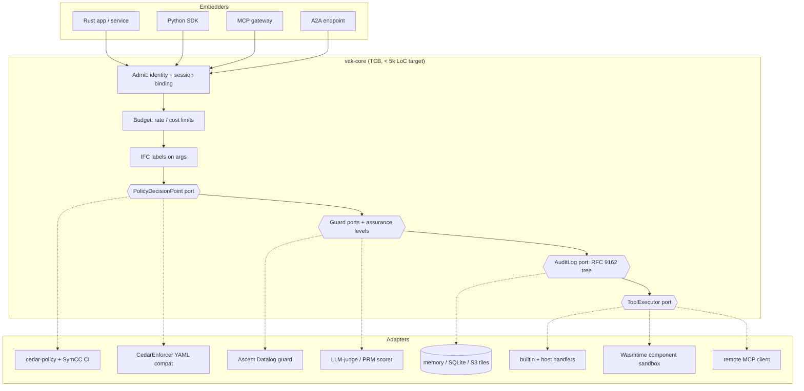

# VAK v2: a research-grounded architecture for the agent kernel library

Status: proposed (October 2026), revised as v2.1. Supersedes the "Technical Architecture"
section of `docs/blue-ocean-opportunity.md` where they conflict. The decision records are
`docs/adr/0002-reference-monitor-core-with-ports-and-transparency-log.md` and, for the
admit, budget and outcome stages, `docs/adr/0003-admit-budget-record-outcome-pipeline-stages.md`.

This document does three things:

1. Records what the code actually does today, with file and line evidence, wherever that
   differs from what its names, docs, or `TODO.md` claim (§2).
2. States the research each subsystem should rest on, and what that research implies
   for the design (§4).
3. Defines the target architecture: a small, analyzable core that mediates every agent
   action, with everything else plugged in through ports, so VAK can be embedded as a
   library and scaled out (§3, §5, §6), plus a phased migration path (§7).

---

## 1. What VAK is, stated precisely

VAK is a **reference monitor for AI agents**. Anderson's 1972 definition is the right
yardstick, because it is the property the project's name promises. A reference monitor
must be:

| Property | Meaning for VAK | Today |
|---|---|---|
| **Complete mediation** | Every agent action goes through one decision point; nothing reaches a tool without it. | Yes, for tool calls, since v2.1. `VakAgent`'s per-agent allow/deny lists used to be enforced client-side; they are now part of the agent's record and checked in the kernel's Admit stage (ADR 0003). |
| **Tamper-proof** | Decisions and their records can't be silently altered. | Partly. The kernel's audit chain was fixed in `a9076d8`, but it lives only in process memory (`src/kernel/mod.rs:115`), and a hash chain can't prove append-only to a third party (§4.2). |
| **Verifiable** | Small enough to analyze and test. | **No.** About 81k lines in one crate, all compiled by default, with no boundary between the trusted core and research prototypes. |

Saltzer and Schroeder's design principles (1975) add the ones VAK must not violate:
**fail-safe defaults** (deny unless permitted), **least privilege**, and **economy of
mechanism**. Most of the findings below violate one of these.

The rest of the stack, including memory, reasoning, swarm coordination and LLM adapters,
is valuable, but it is *not* part of the trusted computing base (TCB). The architecture
below makes that boundary explicit.

---

## 2. Audit: claims versus code

Severity: **S1** means a security guarantee is claimed but not provided. **S2** means the
feature silently does something other than what it says. **S3** means the feature is a
stub or a placeholder.

### 2.1 On the request path (affects every embedder)

| # | Claim | What the code does | Evidence | Sev |
|---|---|---|---|---|
| K1 | Unknown tools are rejected | Any permitted tool name that isn't a built-in or a loaded skill returns `success: true` with `"Tool executed successfully (default handler)"`, though nothing executed. An agent told `transfer_funds` succeeded would act on a lie. | `src/kernel/mod.rs:669` | S1 |
| K2 | WASM skills run with a time limit | Epoch interruption is enabled and `epoch_deadline_trap()` is set, but `set_epoch_deadline` is never called. Per the Wasmtime docs the default deadline is 0, so **every skill traps on its first epoch check**. No test runs a real module through the kernel, so this went unnoticed. | `src/sandbox/mod.rs:211-277` | S2 |
| K3 | Sandbox is scalable | A new `wasmtime::Engine` is created, and the module recompiled, on **every** tool call. Execution is synchronous inside an `async fn`, blocking a Tokio worker for the skill's whole runtime. **Fixed in slice 1b:** `SandboxRuntime` (one engine, SHA-256-keyed module cache, one parked epoch ticker), execution on `spawn_blocking` (ADR 0004). | `src/kernel/mod.rs:634`, `src/sandbox/mod.rs:217` | S2 |
| K4 | Skills are cryptographically signed | The registry's "signature" is an unkeyed SHA-256 over name, version and description, which anyone can recompute. If the module was missing it hashed the module's *path*. `trusted_keys` was never read, and there was an `unwrap()` on that path. (This table originally said `sandbox/verified_publisher.rs` had real Ed25519. It doesn't: it stores key and signature strings and never verifies one.) **Fixed in slice 1c:** Ed25519 over the module digest and the manifest, verified against `security.trusted_skill_keys`, with each skill pinned to the verified module (ADR 0005). | `src/sandbox/registry.rs:519,540` | S1 |
| K5 | Rate limiting, constitution, neuro-symbolic checks protect execution | `RateLimiter`, `Constitution`, `NeuroSymbolicPipeline` and `AsyncPipeline` are declared in `kernel/` but never called by `Kernel::execute`. **v2.1:** rate limiting is enforced by the Budget stage; the others wait for the Guard port. | `src/kernel/mod.rs:31-54,503` | S2 |
| K6 | Audit module provides persistent, signed, rotatable logs | `audit::AuditLogger` (file, SQLite, S3 backends, Ed25519) is **not used by the kernel**. The kernel keeps its own `Vec<AuditEntry>` in RAM, which grows without bound; `get_audit_log` clones all of it. **v2.1:** the kernel's log is the `AuditLog` port; `FileAuditLog` persists it when `audit.log_path` is set. **Fixed in slice 1e:** the port is the only audit path for mediated actions; `SqliteAuditLog` (`audit.format: sqlite`) gives it durable, queryable storage; both durable adapters finish an append even if the caller stops waiting. It is deliberately not rotated, and `AuditLogger` remains a standalone event log (ADR 0007). Entries are still all held in memory until Phase 3's tiles. | `src/kernel/mod.rs:115,875` | S2 |
| K7 | `audit::AuditLogger` hashes are collision-free | Fields are concatenated without length prefixes, so `("ab","c")` and `("a","bc")` hash identically, and `metadata` isn't hashed at all. (The kernel's own entry hash was fixed in `a9076d8`; this one wasn't.) `log` also returned entries its backend failed to store, and rotation broke `verify_chain`. **Fixed in slice 1e:** a version 2 hash with a domain tag, length prefixes and `metadata`; old logs verify only as a prefix, counted in `AuditReport::legacy_entries`; `log` returns `Result`; rotation keeps the chain verifiable and never evicts what it couldn't archive (ADR 0007). | `src/audit/mod.rs:1270-1290` | S1 |
| K8 | Policy attributes reflect the agent | Every principal gets `internal = true`, whoever the agent is. **Fixed in v2.1:** attributes come from the agent's `AgentRecord`; anonymous agents are not internal. | `src/kernel/mod.rs:272` | S2 |
| K9 | `VakRuntime` builder configures the kernel | `with_audit_logging`, `with_policy_enforcement` and `with_sandboxing` are stored in `RuntimeConfig` but never reach `KernelConfig`. `register_tool` registers a schema with no handler, so calls hit K1. | `src/lib_integration.rs:860-880,672` | S2 |
| K10 | Library users can add tools | Only by dropping a WASM skill on disk. `kernel::custom_handlers` has a working handler registry, but the kernel never consults it. The `kernel::traits` ports (`PolicyEvaluator`, `AuditWriter`, …) have no implementations or callers. | `src/kernel/custom_handlers.rs`, `src/kernel/traits.rs` | S3 |
| K11 | WASM skills run in an isolated sandbox | The sandbox is Wasmtime 41.0.4, which has 17 published advisories and no patched 41.x release. They include sandbox escapes (with the Winch backend, and miscompiled heap accesses on aarch64 Cranelift), data leakage between pooling-allocator instances (VAK offers the pooling allocator), and host panics and out-of-bounds accesses in component-model string transcoding. Patched lines: Wasmtime 36 LTS, or 49.0.2 and later. Found by `cargo deny check` while fixing CI; not yet fixed. PyO3 0.24 (feature `python`) had 2 more advisories; **fixed** by moving to 0.29. | `Cargo.toml` (`wasmtime = "41.0.3"`, `pyo3 = "0.24"`) | S1 |

### 2.2 Verification and cryptography

| # | Claim | What the code does | Evidence | Sev |
|---|---|---|---|---|
| V1 | Zero-knowledge proofs of policy compliance | Not a proof system: the verifier accepts any well-formed 64-hex response. (Already flagged in the module docs; still exported and documented as a feature.) | `src/reasoner/zk_proof.rs:46-60,640` | S1 |
| V2 | Z3 formal verification | Every variable is pinned to its concrete value and then checked for SAT. That is evaluation of one input, which needs no solver; it proves nothing about other inputs. Field names and string values are spliced into SMT-LIB unescaped (**SMT injection**). `Matches` uses `str.to.re`, which matches the regex *literally*. `Forbidden` translates to `true`, so `verify` reports it satisfied for any resource. Lists are declared as `Int`, and negative numbers are emitted as `-n`, which isn't an SMT-LIB numeral. | `src/reasoner/z3_verifier.rs:376-430` | S1 |
| V3 | Datalog safety engine (Crepe-style) | Not Datalog: a list of Rust closures, with no fixpoint, no recursion, no negation semantics. Facts match by exact string, so `/etc//shadow` or `/etc/../etc/shadow` bypass the `/etc/shadow` rule. | `src/reasoner/datalog.rs:486-560,846` | S1 |
| V4 | Sparse Merkle proofs (MEM-002) | `get_sibling_hash` always returns the empty-subtree hash, so the root commits only to the last key written. Earlier keys can change without changing the root. | `src/memory/sparse_merkle.rs:442` | S1 |
| V5 | Merkle-verified state tier | Leaves are hashed with `std::collections::hash_map::DefaultHasher` (64-bit SipHash, non-cryptographic). Keys aren't committed, only values. Proofs carry no siblings and verify only for single-element trees. | `src/memory/mod.rs:298-320,682-700` | S1 |

### 2.3 Reasoning, memory, swarm, interop

| # | Claim | What the code does | Evidence | Sev |
|---|---|---|---|---|
| R1 | Process Reward Model | An LLM-as-judge prompt. It is not a trained PRM, and when the model omits a confidence it defaults to 0.7, which is uncalibrated. | `src/reasoner/prm.rs:1-5,533` | S2 |
| R2 | MCTS with simulation | "Simulation" returns the node's PRM score, which is value-guided search rather than rollouts. `simulations_per_expansion` and `max_steps` are ignored, and the terminal test is "≥ 10 steps". | `src/reasoner/tree_search.rs:600,862` | S3 |
| R3 | Hybrid neuro-symbolic loop executes plans | It returns `{"status": "simulated"}`; nothing executes. | `src/reasoner/hybrid_loop.rs:347-352` | S3 |
| R4 | Grammar-constrained decoding | Post-hoc validation only; `allowed_next_tokens` is a stub. VAK has no logit access through `LlmProvider`, so it cannot constrain decoding. Two overlapping modules exist (`llm/constrained.rs`, `reasoner/constrained_decoding.rs`). | `src/llm/constrained.rs:155` | S2 |
| M1 | HNSW / IVF vector index | Only a brute-force scan exists; the `Hnsw` and `IvfFlat` variants are never read. | `src/memory/vector_store.rs:202,625` | S3 |
| M2 | SQLite state backend | It returns `BackendNotAvailable`. | `src/memory/storage.rs:566` | S3 |
| S1 | Byzantine fault-tolerant consensus | A single-round vote tally with a `2f+1` threshold. Votes are unsigned and there are no phases, so a Byzantine agent can impersonate others. | `src/swarm/consensus.rs:525-620` | S2 |
| S2 | Sycophancy detection | It measures entropy of the *final* votes. Unanimity is not sycophancy; the literature measures **opinion change after exposure to peers** (§4.7). | `src/swarm/sycophancy.rs:286-320` | S2 |
| I1 | MCP server | Pinned to protocol `2024-11-05`. The current spec is `2026-07-28`, which uses a stateless core, header routing and hardened OAuth. | `src/integrations/mcp.rs:420` | S3 |
| I2 | A2A protocol with signed messages | An in-process message bus, not the A2A v1.0 HTTP/JSON-RPC protocol. The `signature` field is never set or checked. | `src/swarm/a2a.rs:200` | S2 |
| I3 | MCP `execute_skill` runs a sandboxed skill | Nothing runs. For any skill name it returns `is_error: false` with "Skill '…' executed successfully", the same fake success as K1. When `./skills` exists it loads skills with `new_permissive_dev` (unsigned allowed), outside the kernel's pipeline. Found during slice 1c; not yet fixed. | `src/integrations/mcp.rs:860,884` | S1 |
| I4 | The Python SDK's `Kernel` enforces policy and audits | `vak.Kernel` (`PyKernel`) doesn't use `vak::kernel::Kernel`. It has its own `PolicyEngine` and `AuditLogger`, and `execute_tool` returns `success: "true"` with an echo of its arguments without running anything: the same fake success as K1. Found during slice 1e; not yet fixed. | `src/python.rs:324,526-576` | S1 |
| D1 | Security audit status table: "✅ Audited" | No external audit is referenced anywhere in the repo. | `src/lib.rs:88-95` | S2 |

**What is sound:** the CedarEnforcer path after `a9076d8` (default deny, condition
evaluation, fail-closed loading), the kernel's length-prefixed audit hash chain (and, since slice 1e,
`AuditLogger`'s),
`ed25519-dalek` usage in `audit::AuditSigner`, the `arc-swap` policy hot-reload, and the
built-in tools.

---

## 3. Design principles

1. **One mediation point, small core.** All actions enter through `Kernel::execute`
   (later `Kernel::submit`). The core holds only mediation logic and port traits. Its
   target size is under 5k lines, so it can be reviewed, fuzzed, and eventually
   model-checked.
2. **Ports and adapters.** The core defines traits: `PolicyDecisionPoint`,
   `ToolHandler`/executor, `AuditLog`, `Signer`, `Clock`, `StateStore` and
   `ApprovalChannel`. Implementations live in adapters behind Cargo features, and later
   in separate crates. Embedders swap in their own adapters.
3. **Fail closed, everywhere.** An unknown tool, unloadable policy, unverifiable
   signature, solver returning `unknown`, or guard error each means deny, never a
   default success (fixes K1).
4. **Honest assurance levels.** Every guard declares an `Assurance` level: `Enforced`
   (deterministic, total), `Checked` (sound but partial, e.g. a schema),
   `Heuristic` (LLM judge, regex, entropy) or `Experimental`. Policies can require a
   minimum level for an action, and audit records which levels contributed to each
   decision. A heuristic signal must never be *presented* as enforcement.
5. **Evidence, not assertion.** Every decision yields a receipt: the audit leaf index,
   plus an inclusion proof against a signed tree head that a third party can verify
   without trusting the kernel (§4.2).
6. **Async, stateless, horizontally scalable.** Kernel instances hold no durable state.
   Policy sets are immutable snapshots swapped atomically, audit goes to a sequenced
   log, and blocking work (WASM, solvers) runs off the async executor.

---

## 4. Research basis, subsystem by subsystem

Each subsection gives what the research says, what follows for VAK, and its **assurance
level** once implemented.

### 4.1 Authorization: use real Cedar, and use SMT where it belongs

- **Research.** Cedar (Cutler et al., OOPSLA 2024) was designed to be *analyzable*: its
  semantics are formalized and proved in Lean, and policies compile to SMT so tools can
  decide *properties of whole policy sets*. Those properties are "always allows",
  "always denies", equivalence, subsumption and disjointness, with concrete
  counterexamples. This is the `cedar-policy-symcc` crate (0.2+, verified in Lean; the
  SymCert work). AWS Zelkova (Backes et al., FMCAD 2018) established the pattern of
  using SMT to answer "can *any* request reach this resource?" offline, at policy
  authoring time.
- **Implication.** VAK's "Cedar-style YAML" engine reimplements a fraction of Cedar
  without its guarantees, and its Z3 integration (V2) answers the wrong question.
  (Since slice 2a, ADR 0008, `policy.format: cedar` evaluates real Cedar; since 2b,
  ADR 0009, SymCC proves properties of policy sets in CI and before a reload.)
  - **Per request:** evaluate policies with the real `cedar-policy` crate (4.x,
    MSRV 1.89), with schema validation at load time. Evaluation is deterministic and
    takes microseconds. Assurance: `Enforced`.
  - **Per policy change:** run SymCC checks in CI and before hot-reload. For example,
    "no policy permits `tool:execute` on `restricted` resources" and "new set ⊑ old set
    unless reviewed". Assurance: `Enforced` for the property checked.
  - Keep `CedarEnforcer` (YAML) as a compatibility adapter. Retire the Z3 shell-out,
    or confine it to offline analysis after fixing the injection bug.
- **Runtime-enforcement theory.** Pre-execution gates can enforce exactly the *safety*
  properties, those whose violations are visible on a finite prefix (Schneider,
  "Enforceable Security Policies", 2000). Edit automata, which can buffer, suppress or
  insert actions, are strictly stronger (Ligatti, Bauer and Walker, 2005). Ray (2026,
  arXiv:2607.22868) re-derives this for tool-using agents. VAK's mediation point is a
  pre-execution gate, so policies should be stated as safety properties over the action
  history. The kernel must therefore expose the **session history** to the PDP, not
  just the current request. The `Escalate` decision (human approval) is VAK's form of
  edit-automaton "buffering".
- **Agent-specific policy DSLs.** AgentSpec (Wang, Poskitt and Sun, ICSE 2026) and
  Progent (Shi et al., 2025) both show that trigger/predicate/enforcement rules over
  tool calls, including fallbacks instead of hard failure, cut attack success on
  AgentDojo-style benchmarks to near zero while preserving utility. Their rule shapes
  map onto Cedar `when` clauses plus a kernel-side "fallback action". That is a reason
  to keep the PDP port expressive enough to return `Deny { fallback }`.

### 4.2 Audit: a transparency log, not a hash chain

- **Research.** Linear hash chains (Schneier and Kelsey, 1999) detect modification but
  need O(n) work to verify, and cannot prove to an outsider that today's log extends
  yesterday's. The kernel can truncate and re-extend the tail undetected unless the head
  was anchored externally. Crosby and Wallach (USENIX Security 2009) introduced
  history-tree logs with O(log n) membership *and* incremental (consistency) proofs.
  Certificate Transparency standardized exactly this construction (RFC 6962;
  RFC 9162 §2.1), and it now underpins Sigstore Rekor and Go's checksum database.
  C2SP `tlog-tiles` and `tlog-cosignature` describe how to serve such logs at scale
  and have independent *witnesses* co-sign tree heads.
- **Implication.**
  - Kernel audit entries become leaves of an RFC 9162 Merkle tree (leaf
    `H(0x00 ‖ d)`, node `H(0x01 ‖ l ‖ r)`). The kernel publishes **signed tree heads**
    (`size`, `root`, `timestamp`, Ed25519).
  - Any party holding a tree head can verify one decision with an **inclusion proof**
    (⌈log₂ n⌉ hashes), and can verify that a later head extends an earlier one with a
    **consistency proof**. Truncation and rewriting become detectable by anyone who
    saw an earlier head.
  - The existing per-entry chain hash stays as the leaf payload, so nothing already
    stored is invalidated.
  - Storage is an adapter (memory, SQLite, S3 tiles). The log has a single sequencer per
    tenant; reads and proofs scale horizontally.
  - Assurance: `Enforced` (cryptographic).
- **Done in this change:** `audit::transparency` (RFC 9162 tree, inclusion and
  consistency proofs, signed tree heads), wired into the kernel.

### 4.3 Execution: Wasmtime done properly, then the Component Model

- **Research and docs.** Wasmtime offers two orthogonal limits. *Fuel* is deterministic
  instruction counting. *Epochs* are cheap wall-clock interruption: an engine-wide
  counter is incremented by a ticker thread and each store sets a deadline relative to
  it. The docs state that with epoch interruption enabled and no deadline set, a store
  traps immediately (K2). Wasmtime's own guidance for servers is one shared `Engine`,
  precompiled modules or `InstancePre` cached by content hash, the pooling allocator, a
  single epoch ticker, and async execution or `spawn_blocking`. The Component Model
  (WIT interfaces, WASI 0.2) replaces the hand-rolled `alloc`/ptr/len ABI with typed
  interfaces and gives *capability-based* access: a component gets only the handles it
  is passed, with no ambient authority.
- **Implication.**
  - Fix the deadline (done in this change).
  - Move to a process-wide `SandboxRuntime { engine, module_cache, epoch_ticker }`,
    `spawn_blocking` execution, and a cache keyed by the module's SHA-256.
  - Next, a WIT world `vak:skill/tool` with `execute: func(input: string) -> result<string, string>`
    and host imports only for the capabilities the manifest grants, each host call
    re-entering the kernel's PDP.
  - Assurance: `Enforced` (isolation) and `Checked` (resource limits).
- **Supply chain.** Replace the unkeyed SHA-256 "signature" (K4) with real signatures:
  Ed25519 over the module digest and manifest, verified against a trust root. (Done in
  slice 1c, `sandbox::signing`, written directly on `ed25519-dalek`:
  `verified_publisher` turned out to hold key strings without verifying anything.)
  Then move to Sigstore bundles
  (Newman, Meyers and Torres-Arias, CCS 2022), which add keyless OIDC identities and a
  Rekor transparency-log entry. The `wasmsign2` format embeds signatures in custom
  sections. The OpenSSF Model Signing spec is the analogue for model weights.

### 4.4 Prompt injection: architectural defenses, with detection only as a signal

- **Research.** Indirect prompt injection (Greshake et al., AISec 2023) means any tool
  output can carry instructions. Detectors and classifiers are bypassable by adaptive
  attacks, so the defenses with *provable* properties are architectural:
  - **CaMeL** (Debenedetti et al., 2025): a privileged planner LLM sees only the
    trusted query, a quarantined LLM parses untrusted data, and an interpreter tracks
    *capabilities* (provenance and allowed readers) on every value, checking policies
    before each tool call.
  - **FIDES** (Costa et al., 2025): information-flow labels on agent data.
  - **Design patterns** (Beurer-Kellner et al., 2025): action-selector,
    plan-then-execute, dual-LLM, code-then-execute, context-minimization. The shared
    principle is that once an agent has read untrusted input, that input must not be
    able to trigger consequential actions.
  - Benchmarks: AgentDojo (Debenedetti et al., NeurIPS 2024 D&B).
- **Implication.** This is VAK's most distinctive next-gen opportunity: a kernel that
  sits on every tool call is exactly where **information-flow control** belongs.
  - Each tool result gets a *label*: its source (`user`, `tool:web_fetch`,
    `skill:…`), integrity (`trusted` or `untrusted`), and confidentiality (its allowed
    readers).
  - Agents pass labels back when they use a value as a tool argument. A library helper
    (`Labeled<T>`) does this for in-process agents; for LLM agents, a CaMeL-style plan
    interpreter does it.
  - Policies can read `context.integrity` and `context.readers`, for example
    `forbid(action == "email:send") when { context.args_integrity == "untrusted" && resource.external }`.
  - The regex detector (`reasoner::prompt_injection`) is demoted to a `Heuristic`
    guard: useful for telemetry and triage, never the reason a dangerous action is
    allowed.
  - Assurance: `Enforced` for label propagation inside the kernel. It is only as good
    as the label hygiene of the agent framework outside it, which the docs must say.

### 4.5 Neuro-symbolic reasoning: rename honestly, then make each piece real

- **PRMs.** Process reward models are *trained* step-level verifiers. Examples are
  PRM800K (Lightman et al., ICLR 2024) and automatically labelled steps (Math-Shepherd,
  Wang et al., ACL 2024). An LLM prompted to score steps is an *LLM judge* (Zheng
  et al., NeurIPS 2023 D&B), with known position and verbosity biases. Self-reported
  confidences are poorly calibrated (Xiong et al., ICLR 2024).
  - Introduce a `StepScorer` port, with `LlmJudgeScorer` (the current code, `Heuristic`)
    and `RewardModelScorer` (an HTTP endpoint serving a trained PRM).
  - Record calibration (expected calibration error on a held-out set) before any score
    is used as a gate.
  - The `prm_toolkit` fine-tuning module becomes the path to producing
    `RewardModelScorer` checkpoints.
- **Tree search.** UCT (Kocsis and Szepesvári, 2006) and Tree of Thoughts (Yao et al.,
  NeurIPS 2023) are implemented reasonably. Replacing rollouts with a learned value is
  legitimate (the AlphaGo Zero value head, Silver et al., 2017), but the docs must say
  "value-guided", and the ignored configuration fields should go.
- **Datalog.** Real Datalog means semi-naive fixpoint evaluation with stratified
  negation (Abiteboul, Hull and Vianu, 1995). Rust has mature engines: Ascent
  (Sahebolamri, Gilray and Micinski, CC 2022), with lattices, semi-naive evaluation and
  compile-time rules, plus an interpreter for runtime rules; also `datafrog` and
  `crepe`.
  - Either port the rule set to Ascent, which suits the recursive rules over the action
    history that safety properties need, or express those rules as Cedar policies and
    delete the module.
  - Either way, canonicalize paths before matching (V3).
  - Assurance: `Enforced` (decidable, total).
- **ZK proofs.** A hash commitment has no algebraic structure, so no verifier can check
  a response without the witness (V1). Production options in 2026 are zkVMs (RISC Zero,
  SP1), which prove "this Rust program ran on these committed inputs" with
  STARK→SNARK proofs. The meaningful VAK statement is: *"the Cedar evaluator returned
  Allow for a request whose hash is H, under a policy set whose hash is P."* That is a
  research track, behind an `experimental-zk` feature. The current module should not be
  in the default build.
- **Constrained decoding.** True constrained decoding masks logits at each token
  (Willard and Louf, 2023; XGrammar, Dong et al., MLSys 2025; llguidance). It needs
  access to the inference server. VAK should pass JSON Schema or grammars through
  `LlmProvider` to providers that support structured outputs, keep post-hoc validation
  as a `Checked` guard, and merge the two duplicate modules.

### 4.6 Memory

- **Sparse Merkle trees.** Use a known-correct construction: Dahlberg, Pulls and
  Peeters' efficient SMT (2016), or the Jellyfish Merkle Tree used by Diem/Aptos. Every
  internal node on a path must be derived from real siblings (fixes V4). Leaves commit
  to `(key, value)` with domain separation, using SHA-256 (fixes V5).
- **Append-only episodic memory** is a log, so it reuses the §4.2 transparency log
  rather than a separate Merkle chain.
- **Vector search.** Brute force is fine below about 10⁵ vectors. Above that, an HNSW
  adapter (Malkov and Yashunin, TPAMI 2020) or an external vector database sits behind
  the existing `VectorStore` trait. Remove the unused index variants until one is
  implemented.

### 4.7 Multi-agent coordination

- **Consensus.** PBFT-class protocols (Castro and Liskov, OSDI 1999) need authenticated
  messages and multi-phase agreement. Most agent swarms are run by a single operator and
  don't face Byzantine replicas; they face *correlated errors*.
  - Rename `BftConsensus` to `QuorumVote`.
  - Require Ed25519-signed votes (identity-bound to `AgentId`).
  - Reserve "BFT" for an adapter over a real protocol if cross-organization swarms
    appear.
- **Quadratic voting** (Lalley and Weyl, 2018) assumes sybil resistance. With
  kernel-issued agent identities and per-identity credit budgets enforced by the kernel,
  that assumption holds inside one deployment.
- **Sycophancy and conformity.** Sharma et al. (ICLR 2024) define sycophancy as matching
  a stated view against one's own belief. In multi-agent debate (Du et al., ICML 2024),
  the measurable failure is *conformity*: agents abandoning correct answers after seeing
  peers. Recent work measures this as stance change between a blind first round and
  post-exposure rounds.
  - Redesign the detector to collect an **independent first vote** before any agent
    sees peers.
  - Report the flip rate toward the majority, and the flip rate away from initially
    correct answers when ground truth is available.
  - Entropy of final votes stays as a secondary signal only.

### 4.8 Interoperability and observability

- **MCP `2026-07-28`.** The protocol is stateless: there is no `initialize` handshake,
  and requests are self-describing via `_meta`. `Mcp-Method` and `Mcp-Name` headers let
  gateways authorize *before parsing bodies*. That makes VAK a natural **MCP policy
  gateway**: `tools/call` maps to Cedar `Action::"tool:execute"` and
  `Resource::"tool:<Mcp-Name>"`. Implement the server per the current spec, plus a
  client adapter so the kernel can mediate calls to *remote* MCP servers.
  `resultType: "input_required"` (multi round-trip requests) maps onto VAK's
  `Escalate`.
- **A2A v1.0** (Linux Foundation, March 2026): JSON-RPC over HTTPS, and Agent Cards at
  `/.well-known/agent-card.json` signed with JWS (RFC 7515) over JCS-canonical JSON
  (RFC 8785). Replace the in-process bus's unused `signature` field with
  verification of Agent Card signatures, and mediate inbound A2A tasks through the
  kernel like any other action.
- **OpenTelemetry GenAI semantic conventions** (development status): emit
  `invoke_agent` and `execute_tool` spans, carrying the policy decision, assurance level
  and audit leaf index as attributes. The audit log is the integrity record; traces are
  the operational view, linked by leaf index.

---

## 5. Target architecture



### 5.1 The mediation pipeline

`Kernel::execute(agent, session, request)` runs these steps in order:

1. **Admit.** Check that the agent is bound to the session and is not suspended.
2. **Budget.** Check rate and cost limits, using `RateLimiter`, which already exists but
   isn't called today.
3. **Decide.** Call `PolicyDecisionPoint::decide`. The PDP sees the request, principal
   attributes, resource attributes, IFC labels and session history.
4. **Guard.** Run zero or more guards. Each guard returns `Pass`, `Deny` or `Escalate`
   with its `Assurance` level. A policy can require, for example, `min_assurance =
   Enforced` for `payment:*`, so an LLM judge can *add* denials but never be the only
   thing standing between an agent and a high-risk action.
5. **Record.** Append the decision leaf (written *before* execution) and get back an
   index and a tree head.
6. **Execute.** The executor registry resolves the tool in this order: built-in,
   registered handler, WASM skill, otherwise `ToolNotFound`.
7. **Record the outcome.** Append an outcome leaf that links to the decision leaf.
8. **Respond.** Return the `ToolResponse` with a receipt: `{ leaf_index, tree_size, root }`.

### 5.2 Ports (traits)

| Port | Responsibility | Default adapter | Status |
|---|---|---|---|
| `PolicyDecisionPoint` | request + context → `PolicyDecision` | `CedarPolicy` (the `cedar-policy` crate) if `policy.format: cedar`; `CedarEnforcer` (YAML) if `policy_paths` set; else `ConfigPolicy` (allowlist + default deny). `DenyAll` when configured policies don't load | **added in this change**; Cedar in 2a |
| `ToolHandler` | execute one named tool | registry of host closures | wired in this change (existed, unused) |
| `AgentRegistry` | agent → record (attributes, status, tool scope) | `InMemoryAgentRegistry` | **added in v2.1** |
| `Budget` | charge one request to an agent's budget | `AgentRateBudget` (token bucket) or `Unlimited` | **added in v2.1** |
| `AuditLog` | append; tree head; inclusion and consistency proofs | `MemoryAuditLog`, or `FileAuditLog` / `SqliteAuditLog` (by `audit.format`) when `audit.log_path` is set | **added in v2.1**; SQLite in 1e |
| `Guard` | extra pre-execution checks with an assurance level | none | next |
| `Signer` | sign tree heads | Ed25519 (`ed25519-dalek`) | tree-head signing added |
| `StateStore`, `Clock`, `ApprovalChannel` | persistence, time, human-in-the-loop | memory, system clock, deny | later |

### 5.3 Packaging: from one crate to a workspace with feature flags

Phase 1 keeps one crate but gates heavy and experimental modules behind features, so
`vak = { default-features = false }` builds only the core. As built in slice 1d
(ADR 0006):

| Feature | Modules | Optional deps | Default |
|---|---|---|---|
| *(core)* | `kernel` (minus skills and the neuro-symbolic pipeline), `policy`, `audit`, `secrets`, `lib_integration` | none | always |
| `wasm` | `sandbox`, `kernel::skills` | wasmtime | yes |
| `llm` | `llm` | tokio-stream | via `memory` |
| `memory` | `memory` (all tiers) | petgraph | yes |
| `reasoner` | `reasoner` (except zk), `sandbox::reasoning_host`, `kernel::neurosymbolic_pipeline` | none | no (Heuristic) |
| `experimental-zk` | `reasoner::zk_proof` | none | no |
| `swarm` | `swarm` | none | no |
| `integrations` | `integrations` (MCP, LangChain, AutoGPT); implies `reasoner`, `wasm` | none | no |
| `dashboard` | `dashboard`, `api`; implies `swarm` | none | no |
| `legacy-tools` | `tools::skill_sign` (superseded by `sandbox::signing`) | base64 | no |
| `python` | `python` | pyo3 | no |
| `full` | everything except `python` | | no |
| `cedar` | `policy::cedar` engine and `kernel::CedarPolicy` over `cedar-policy` (slice 2a, ADR 0008); 64 more packages | cedar-policy | no; in `full` |
| `cedar-analysis` | `policy::cedar::analysis`: SymCC proofs, checked reloads (slice 2b, ADR 0009); runs cvc5 1.3.1; 4 more packages | cedar-policy-symcc | no; in `full` |

Departures from the plan above, with reasons:

- `integrations` is off by default: all three adapters embed the `reasoner` (the MCP server
  uses the Datalog engine; LangChain and AutoGPT use the PRM), and the MCP server carries
  finding I3.
- There is no `sqlite` feature. Since slice 1e (ADR 0007) the kernel's own durable log can
  be SQLite (`SqliteAuditLog`), so `rusqlite` belongs to the core.
- `rs_merkle` was a dependency no module used. It is removed.
- The core build depends on 210 packages instead of 301 (normal and build dependencies), and Wasmtime and petgraph are absent.

Phase 3 splits along the same lines into `vak-core`, `vak-audit`, `vak-sandbox`,
`vak-policy-cedar`, `vak-memory`, `vak-reasoner`, `vak-swarm`, `vak-mcp`, `vak-a2a` and
`vak-py`. A `vak` facade crate re-exports them by feature. Splitting enforces the TCB
boundary at compile time: `vak-core` cannot depend on `vak-reasoner`.

### 5.4 Scalability model

- **Stateless kernel workers.** Policy sets are `Arc` snapshots swapped with `arc-swap`.
  Tool handlers are `Arc<dyn ToolHandler>`. Any number of workers can serve one tenant.
- **Audit sequencing.** There is one append sequencer per tenant log. That is the only
  serialization point, at about 10⁵ appends/s per core for SHA-256 leaves. Readers,
  proof generation and verification are lock-free on immutable tiles (C2SP
  `tlog-tiles`). Cross-tenant scaling is by sharding logs.
- **Execution.** There is one Wasmtime `Engine` per process, with a module cache keyed
  by digest, the pooling allocator, one epoch ticker, and `spawn_blocking` (or Wasmtime
  async) so the Tokio runtime never blocks.
- **Backpressure.** `AsyncPipeline`, which already exists, becomes the bounded queue in
  front of `execute`, with per-tenant budgets from step 2.

### 5.5 Library API (target shape)

```rust
use vak::kernel::{Kernel, KernelConfig, custom_handlers::FunctionHandler};

let kernel = Kernel::builder(KernelConfig::default())
    .with_policy(my_cedar_pdp)                      // Arc<dyn PolicyDecisionPoint>
    .with_tool(FunctionHandler::new("lookup", |req, _agent| async move { ... }))
    .build()
    .await?;

let response = kernel.execute(&agent, &session, request).await?;
let head = kernel.audit_tree_head().await;           // signed, publishable
let proof = kernel.prove_audit_inclusion(0).await?;  // anyone can verify
```

---

## 6. Assurance matrix

| Component | Today | After this change | Target |
|---|---|---|---|
| Mediation (`Kernel::execute`) | Checked (unknown tools fake success) | **Enforced** (fail closed) | Enforced + model-checked pipeline |
| Policy (YAML CedarEnforcer) | Enforced (post-a9076d8) | Enforced, behind a port | real Cedar + SymCC: Enforced + analyzed |
| Admission and budget | none: constant attributes (K8), unenforced rate limit (K5) | **Enforced** (v2.1: registry, session binding, scope, token bucket) | shared adapters for fleets |
| Audit | Enforced, but in-RAM and O(n) | **Enforced, with O(log n) inclusion and consistency proofs** | + persistent tiles, witness cosigning |
| WASM sandbox | broken (traps immediately) | **works, with wall-clock deadline; shared engine and module cache, off the async executor (1b)** | Component Model, signed skills |
| Skill signatures | none (unkeyed hash) | **Ed25519 against a trust root, module pinned (1c)** | Sigstore, witness-logged |
| Z3 verifier | unsafe (SMT injection) | **injection closed; untranslatable constraints fail closed** | replaced by SymCC for policy analysis |
| Datalog | Heuristic (exact strings) | Heuristic (documented) | Ascent: Enforced |
| PRM / ToT | Heuristic (LLM judge) | Heuristic (documented) | trained PRM + calibration |
| Prompt-injection | Heuristic (regex) | Heuristic | IFC labels: Enforced |
| ZK proofs | unsound | unsound (documented, not default) | zkVM research track |
| Swarm consensus | unauthenticated tally | unchanged | signed `QuorumVote` |

---

## 7. Migration plan

Each phase ends with `cargo test`, `cargo clippy --all-targets -- -D warnings`, and the
phase's exit criterion.

**Phase 0: make the request path true (this change)**
- [x] Unknown tools fail closed (`KernelError::ToolNotFound`) (K1).
- [x] WASM epoch deadline set from `SandboxConfig::timeout`, with a watchdog that
      enforces wall-clock time, tested with a real module (K2).
- [x] `PolicyDecisionPoint` port; `ConfigPolicy` and the `CedarEnforcer` adapter move
      behind it; `Kernel::builder` for injection (K10).
- [x] `ToolHandler` registry wired into dispatch (K10), plus `Kernel::register_tool`.
- [x] RFC 9162 transparency log for the kernel audit trail: tree heads, inclusion and
      consistency proofs, Ed25519-signed tree heads, verified against RFC 6962 test
      vectors (§4.2).
- [x] SMT-LIB injection closed. `Matches`, `Forbidden` and list values are rejected
      rather than translated wrongly; negative numbers use `(- n)` (V2).
- [x] Host tool handlers run behind a panic boundary and the execution timeout.
- [x] Removed `src/prelude.rs`, which was never compiled.
- [x] Memory Merkle tier hashes with SHA-256 and domain separation, and commits to keys
      (V5).
- [x] `VakRuntime` builder flags reach `KernelConfig` (K9).
- [x] Honest status table in `lib.rs` (D1).
- Exit criterion: no S1 finding on the request path except K4 and K8, which are tracked
  for Phase 1.

**Phase 1: library hardening (2 to 4 weeks)**
- [x] Slice 1a (v2.1, ADR 0003): `AgentRegistry` port and the Admit stage (status,
      session binding, per-agent tool scope moved from `VakAgent` into the kernel rather
      than the PDP, so no PDP can widen it), principal attributes from the record (K8);
      `Budget` port and the Budget stage from `security.*` (K5); `AuditLog` port with
      memory and JSONL file adapters; outcome leaves; receipts on `ToolResponse`; the
      async-host enforcer denies when it can't be built.
- [x] Slice 1e (ADR 0007): the `AuditLog` port is the one audit path for mediated actions.
      `SqliteAuditLog` (`audit.format: sqlite`) verifies on open and fails closed; durable
      appends finish even if the caller stops waiting; the log is never rotated (K6).
      `AuditLogger` stays as a standalone event log, with a version 2 hash over
      length-prefixed fields and `metadata`, write failures returned as errors, and
      rotation that keeps the chain verifiable (K7).
- [x] Slice 1b (ADR 0004): shared `SandboxRuntime` (engine, module cache keyed by
      SHA-256, one epoch ticker that parks while idle); `spawn_blocking` execution;
      untrusted skill output bounds-checked. Pooling allocator available, opt-in.
- [x] Slice 1d (ADR 0006): feature gates per §5.3. `default-features = false` builds the
      core alone (210 packages instead of 301, no Wasmtime) and its tests pass; `full` builds everything
      but the Python bindings, and CI tests with it plus a core-only job.
- [x] Slice 1c (ADR 0005): Ed25519 skill signatures over the module digest and every
      manifest field but `wasm_path`, verified against `security.trusted_skill_keys`;
      unsigned skills refused unless `security.allow_unsigned_skills`; each skill pinned
      to the verified module's digest, which outcome leaves record (K4).
- [x] Exit criterion: one end-to-end test signs a skill, loads it, executes it, and
      verifies the inclusion proof for both decision and outcome leaves
      (`tests/signed_skills.rs`, against a tree head over the log reloaded from disk).
      Phase 1 is complete.

**Phase 2: research-grade enforcement (1 to 2 months)**
- [x] Slice 2a (ADR 0008): the `cedar` feature; `policy.format: cedar` decides with the
      `cedar-policy` crate. Its `Vak` schema has an agent principal, per-tool actions for
      typed arguments, and a tool resource. Policies are validated strictly at load, and
      calls that don't match the schema are denied. So is any call on which a policy
      errors, which Cedar alone would let through a failing `forbid`.
      `policies/cedar/default.cedar` ports the tool-call rules of
      `default_policies.yaml`, and a test shows both decide 24 calls alike.
- [x] Slice 2b (ADR 0009): the `cedar-analysis` feature proves properties of whole policy
      sets with SymCC and cvc5. Properties are Cedar policy sets: ceilings (the most the
      policies may allow, e.g. no restricted tool) and floors (what they must keep
      allowing). Every policy is also checked never to error. `CedarPolicy` reloads
      while running, and `reload_checked` swaps a new set in only once the properties
      hold and it allows nothing the old set didn't. CI installs cvc5 and proves the
      shipped policies. The analysis found that slice 2a's payments example let a
      finance agent use a blocked tool.
- IFC labels on tool results and arguments; label-aware policies; the AgentDojo harness
  as a benchmark.
- `Guard` port with assurance levels; Datalog rules on Ascent with canonical paths.
- Correct sparse Merkle tree (V4); episodic memory on the transparency log.
- Exit criterion: on AgentDojo, attack success rate with VAK IFC policies is ≤ the
  published CaMeL and Progent numbers, at equal or better utility.

**Phase 3: ecosystem (ongoing)**
- MCP `2026-07-28` server and client adapter; A2A v1.0 with signed Agent Cards.
- OpenTelemetry GenAI spans.
- Workspace split per §5.3.
- Research tracks behind features: zkVM-proved Cedar evaluation, trained PRM scorer
  with a calibration report, conformity-aware swarm voting.

---

## 8. References

Classic security and systems
- J. P. Anderson. *Computer Security Technology Planning Study*. ESD-TR-73-51, 1972.
- J. H. Saltzer, M. D. Schroeder. "The Protection of Information in Computer Systems." *Proc. IEEE*, 1975.
- F. B. Schneider. "Enforceable Security Policies." *ACM TISSEC*, 2000.
- J. Ligatti, L. Bauer, D. Walker. "Edit Automata: Enforcement Mechanisms for Run-time Security Policies." *IJIS*, 2005.
- B. Schneier, J. Kelsey. "Secure Audit Logs to Support Computer Forensics." *ACM TISSEC*, 1999.
- S. A. Crosby, D. S. Wallach. "Efficient Data Structures for Tamper-Evident Logging." *USENIX Security*, 2009.
- B. Laurie, A. Langley, E. Kasper. RFC 6962, *Certificate Transparency*, 2013.
- B. Laurie, E. Messeri, R. Stradling. RFC 9162, *Certificate Transparency Version 2.0*, 2021. https://www.rfc-editor.org/rfc/rfc9162.html
- C2SP. `tlog-tiles`, `tlog-cosignature`, `signed-note`. https://c2sp.org
- M. Castro, B. Liskov. "Practical Byzantine Fault Tolerance." *OSDI*, 1999.
- R. Dahlberg, T. Pulls, R. Peeters. "Efficient Sparse Merkle Trees." *NordSec*, 2016.

Authorization and verification
- J. Cutler et al. "Cedar: A New Language for Expressive, Fast, Safe, and Analyzable Authorization." *OOPSLA*, 2024. https://arxiv.org/abs/2403.04651
- `cedar-policy` crate (4.x): https://crates.io/crates/cedar-policy; `cedar-policy-symcc`: https://crates.io/crates/cedar-policy-symcc
- SymCert: Verifying SMT-based policy analyses. https://www.amazon.science/publications/symcert-verifying-smt-based-policy-analyses
- J. Backes et al. "Semantic-based Automated Reasoning for AWS Access Policies using SMT." *FMCAD*, 2018.
- S. Abiteboul, R. Hull, V. Vianu. *Foundations of Databases*. Addison-Wesley, 1995.
- A. Sahebolamri, T. Gilray, K. Micinski. "Seamless Deductive Inference via Macros." *CC*, 2022. https://s-arash.github.io/ascent/cc22main-p95-seamless-deductive-inference-via-macros.pdf

Agent security
- K. Greshake et al. "Not What You've Signed Up For: Compromising Real-World LLM-Integrated Applications with Indirect Prompt Injection." *AISec*, 2023.
- E. Debenedetti et al. "AgentDojo." *NeurIPS Datasets & Benchmarks*, 2024.
- E. Debenedetti et al. "Defeating Prompt Injections by Design" (CaMeL), 2025. https://arxiv.org/abs/2503.18813
- L. Beurer-Kellner et al. "Design Patterns for Securing LLM Agents against Prompt Injections," 2025. https://arxiv.org/abs/2506.08837
- M. Costa et al. "Securing AI Agents with Information-Flow Control" (FIDES), 2025.
- T. Shi et al. "Progent: Programmable Privilege Control for LLM Agents," 2025. https://arxiv.org/abs/2504.11703
- H. Wang, C. M. Poskitt, J. Sun. "AgentSpec: Customizable Runtime Enforcement for Safe and Reliable LLM Agents." *ICSE*, 2026. https://arxiv.org/abs/2503.18666
- S. Ray. "What Can Be Enforced? A Theory of Certified Runtime Safety for Tool-Using Agents," 2026. https://arxiv.org/abs/2607.22868
- K. Mei et al. "AIOS: LLM Agent Operating System." *COLM*, 2025. https://arxiv.org/abs/2403.16971

Reasoning
- H. Lightman et al. "Let's Verify Step by Step." *ICLR*, 2024. https://arxiv.org/abs/2305.20050
- P. Wang et al. "Math-Shepherd." *ACL*, 2024. https://aclanthology.org/2024.acl-long.510.pdf
- L. Zheng et al. "Judging LLM-as-a-Judge with MT-Bench and Chatbot Arena." *NeurIPS D&B*, 2023.
- M. Xiong et al. "Can LLMs Express Their Uncertainty?" *ICLR*, 2024.
- L. Kocsis, C. Szepesvári. "Bandit Based Monte-Carlo Planning." *ECML*, 2006.
- S. Yao et al. "Tree of Thoughts." *NeurIPS*, 2023.
- D. Silver et al. "Mastering the Game of Go without Human Knowledge." *Nature*, 2017.
- B. T. Willard, R. Louf. "Efficient Guided Generation for Large Language Models," 2023.
- Y. Dong et al. "XGrammar." *MLSys*, 2025. llguidance: https://docs.rs/llguidance

Multi-agent
- S. P. Lalley, E. G. Weyl. "Quadratic Voting: How Mechanism Design Can Radicalize Democracy." *AEA P&P*, 2018.
- M. Sharma et al. "Towards Understanding Sycophancy in Language Models." *ICLR*, 2024.
- Y. Du et al. "Improving Factuality and Reasoning in Language Models through Multiagent Debate." *ICML*, 2024.

Sandboxing and supply chain
- A. Haas et al. "Bringing the Web up to Speed with WebAssembly." *PLDI*, 2017.
- Wasmtime `Store::set_epoch_deadline`: https://docs.wasmtime.dev/api/wasmtime/struct.Store.html
- Z. Newman, J. S. Meyers, S. Torres-Arias. "Sigstore: Software Signing for Everybody." *CCS*, 2022.
- S. Torres-Arias et al. "in-toto: Providing Farm-to-Table Guarantees for Bits and Bytes." *USENIX Security*, 2019.
- wasmsign2: https://github.com/wasm-signatures/wasmsign2; OpenSSF Model Signing: https://github.com/ossf/model-signing-spec
- Y. A. Malkov, D. A. Yashunin. "Efficient and Robust Approximate Nearest Neighbor Search Using HNSW Graphs." *TPAMI*, 2020.

Protocols and observability
- Model Context Protocol, specification `2026-07-28`. https://blog.modelcontextprotocol.io/posts/2026-07-28/
- A2A Protocol v1.0 (Linux Foundation). Agent Card signatures: RFC 7515 (JWS), RFC 8785 (JCS).
- OpenTelemetry GenAI agent spans. https://github.com/open-telemetry/semantic-conventions-genai/blob/main/docs/gen-ai/gen-ai-agent-spans.md

*Method note.* The code findings in §2 come from reading the source at commit `a9076d8`.
The research claims in §4 rest on the papers and specs above. arXiv was unreachable from
the environment this was written in, so 2025–2026 preprints are summarized from their
abstracts and secondary sources rather than full text. Check those before citing them in
a paper.
